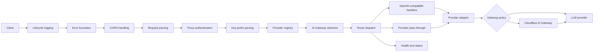

# Architecture Overview

## Scope

The Worker presents one authenticated edge endpoint for multiple LLM APIs. It
supports OpenAI-compatible Chat Completions, Responses, Anthropic-compatible
Messages, model aggregation, provider-specific pass-through, and Cloudflare AI
Gateway routes.

User-facing commands and endpoint examples live in the
[documentation index](../../index.md). Architecture and scope follow the
[project principles](../project-principles.md).

## Request flow

A typed Hono entry application prepares the request before passing the original
Request and request-scoped state to a Hono routing application. Prefix parsing
therefore precedes route matching without copying or buffering the body.

State and credential isolation are defined in [request
processing](features/request-processing.md#request-scoped-environment-and-failures)
and [security](features/security_config.md).

## Detailed design

### Request processing

- [Request processing](features/request-processing.md)
- [Security and configuration](features/security_config.md)

### Provider behavior and reliability

- [Native inference endpoint selection](features/native_inference.md)
- [OpenCode providers and live protocol selection](features/opencode.md)
- [Provider abstraction](features/provider_abstraction.md)
- [Key rotation](features/key_rotation.md)
- [Virtual models](features/virtual_models.md)

### Cloudflare integration and diagnostics

- [AI Gateway integration](features/ai_gateway.md)
- [Monitoring and diagnostics](features/monitoring_diagnostics.md)
- [Request-path performance](features/performance.md)

## Authoritative implementation points

| Concern                               | Source                       |
| ------------------------------------- | ---------------------------- |
| Middleware order                      | `src/index.ts`               |
| Hono route declarations and execution | `src/routing.ts`             |
| Built-in providers                    | `src/providers.ts`           |
| Configuration shape                   | `schemas/config-schema.json` |
| Worker bindings and migrations        | `cloudflare.config.ts`       |
| Secret and key-selection policy       | `src/utils/secrets.ts`       |
